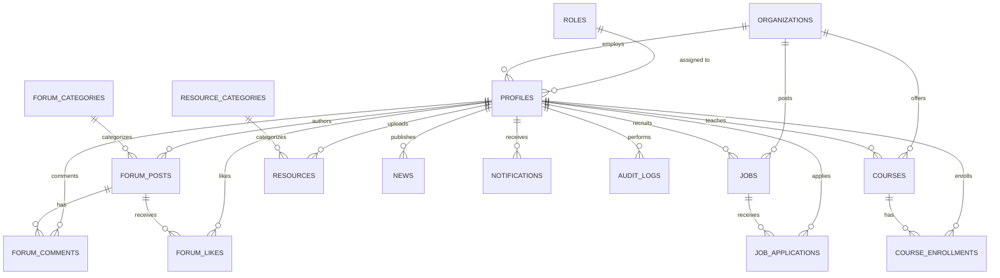

# Database Schema Documentation — Food Analyst Forum (FAF)

This document provides the complete PostgreSQL database schema design for **Food Analyst Forum (FAF)**, built on Supabase.

---

## 📊 Entity Relationship Diagram (ERD)

---

## 📋 Table Definitions (17 Tables)

### 1. `roles`

Stores application roles and permission levels.

| Column        | Type          | Constraints                                | Description                                                                              |
| :------------ | :------------ | :----------------------------------------- | :--------------------------------------------------------------------------------------- |
| `id`          | `UUID`        | `PRIMARY KEY`, Default `gen_random_uuid()` | Unique role identifier                                                                   |
| `name`        | `TEXT`        | `UNIQUE`, `NOT NULL`, Check Enum           | Role name (`Guest`, `User`, `Recruiter`, `Trainer`, `Moderator`, `Admin`, `Super Admin`) |
| `description` | `TEXT`        | Optional                                   | Role description                                                                         |
| `created_at`  | `TIMESTAMPTZ` | Default `now()`, `NOT NULL`                | Creation timestamp                                                                       |
| `updated_at`  | `TIMESTAMPTZ` | Default `now()`, `NOT NULL`                | Last update timestamp                                                                    |

### 2. `organizations`

Stores food safety laboratories, corporate entities, institutes, and training centers.

| Column       | Type          | Constraints                                | Description                                                          |
| :----------- | :------------ | :----------------------------------------- | :------------------------------------------------------------------- |
| `id`         | `UUID`        | `PRIMARY KEY`, Default `gen_random_uuid()` | Unique organization ID                                               |
| `name`       | `TEXT`        | `NOT NULL`                                 | Organization legal name                                              |
| `type`       | `TEXT`        | `NOT NULL`, Check Enum                     | Type (`Laboratories`, `Companies`, `Institutes`, `Training Centers`) |
| `logo_url`   | `TEXT`        | Optional                                   | Brand logo image URL                                                 |
| `website`    | `TEXT`        | Optional                                   | Organization URL                                                     |
| `email`      | `TEXT`        | Optional                                   | Contact email                                                        |
| `phone`      | `TEXT`        | Optional                                   | Contact phone number                                                 |
| `address`    | `TEXT`        | Optional                                   | Street address                                                       |
| `city`       | `TEXT`        | Optional                                   | City                                                                 |
| `state`      | `TEXT`        | Optional                                   | State/Province                                                       |
| `country`    | `TEXT`        | Optional                                   | Country                                                              |
| `verified`   | `BOOLEAN`     | Default `FALSE`, `NOT NULL`                | Verification status                                                  |
| `created_at` | `TIMESTAMPTZ` | Default `now()`, `NOT NULL`                | Creation timestamp                                                   |
| `updated_at` | `TIMESTAMPTZ` | Default `now()`, `NOT NULL`                | Update timestamp                                                     |
| `deleted_at` | `TIMESTAMPTZ` | Optional                                   | Soft delete timestamp                                                |

### 3. `profiles`

User profiles referencing `auth.users`, `roles`, and `organizations`.

| Column            | Type          | Constraints                                                  | Description                   |
| :---------------- | :------------ | :----------------------------------------------------------- | :---------------------------- |
| `id`              | `UUID`        | `PRIMARY KEY`, References `auth.users(id)` ON DELETE CASCADE | Matches Supabase Auth user ID |
| `email`           | `TEXT`        | `UNIQUE`, `NOT NULL`                                         | User email address            |
| `full_name`       | `TEXT`        | Optional                                                     | Full display name             |
| `avatar_url`      | `TEXT`        | Optional                                                     | Profile image URL             |
| `headline`        | `TEXT`        | Optional                                                     | Professional headline         |
| `bio`             | `TEXT`        | Optional                                                     | Professional biography        |
| `phone`           | `TEXT`        | Optional                                                     | Contact phone                 |
| `role_id`         | `UUID`        | FK `roles(id)` ON DELETE SET NULL                            | Assigned user role            |
| `organization_id` | `UUID`        | FK `organizations(id)` ON DELETE SET NULL                    | Affiliated organization       |
| `created_at`      | `TIMESTAMPTZ` | Default `now()`, `NOT NULL`                                  | Creation timestamp            |
| `updated_at`      | `TIMESTAMPTZ` | Default `now()`, `NOT NULL`                                  | Update timestamp              |
| `deleted_at`      | `TIMESTAMPTZ` | Optional                                                     | Soft delete timestamp         |

### 4. `forum_categories`

Categories for community forum discussions.

| Column          | Type          | Constraints                                | Description            |
| :-------------- | :------------ | :----------------------------------------- | :--------------------- |
| `id`            | `UUID`        | `PRIMARY KEY`, Default `gen_random_uuid()` | Category ID            |
| `name`          | `TEXT`        | `UNIQUE`, `NOT NULL`                       | Category name          |
| `slug`          | `TEXT`        | `UNIQUE`, `NOT NULL`                       | URL slug               |
| `description`   | `TEXT`        | Optional                                   | Description            |
| `icon`          | `TEXT`        | Optional                                   | Lucide icon identifier |
| `display_order` | `INTEGER`     | Default `0`, `NOT NULL`                    | Sorting order          |
| `created_at`    | `TIMESTAMPTZ` | Default `now()`, `NOT NULL`                | Creation timestamp     |
| `updated_at`    | `TIMESTAMPTZ` | Default `now()`, `NOT NULL`                | Update timestamp       |

### 5. `forum_posts`

Community forum posts.

| Column           | Type          | Constraints                                  | Description                               |
| :--------------- | :------------ | :------------------------------------------- | :---------------------------------------- |
| `id`             | `UUID`        | `PRIMARY KEY`, Default `gen_random_uuid()`   | Post ID                                   |
| `author_id`      | `UUID`        | FK `profiles(id)` ON DELETE CASCADE          | Post author                               |
| `category_id`    | `UUID`        | FK `forum_categories(id)` ON DELETE RESTRICT | Category ID                               |
| `title`          | `TEXT`        | `NOT NULL`                                   | Post title                                |
| `slug`           | `TEXT`        | `UNIQUE`, `NOT NULL`                         | URL slug                                  |
| `content`        | `TEXT`        | `NOT NULL`                                   | Markdown content                          |
| `status`         | `TEXT`        | Default `'published'`, Check Enum            | Status (`draft`, `published`, `archived`) |
| `views_count`    | `INTEGER`     | Default `0`, `NOT NULL`                      | View count                                |
| `likes_count`    | `INTEGER`     | Default `0`, `NOT NULL`                      | Like count                                |
| `comments_count` | `INTEGER`     | Default `0`, `NOT NULL`                      | Comment count                             |
| `created_at`     | `TIMESTAMPTZ` | Default `now()`, `NOT NULL`                  | Creation timestamp                        |
| `updated_at`     | `TIMESTAMPTZ` | Default `now()`, `NOT NULL`                  | Update timestamp                          |
| `deleted_at`     | `TIMESTAMPTZ` | Optional                                     | Soft delete timestamp                     |

### 6. `forum_comments`

Discussion comments on forum posts.

| Column       | Type          | Constraints                                | Description                          |
| :----------- | :------------ | :----------------------------------------- | :----------------------------------- |
| `id`         | `UUID`        | `PRIMARY KEY`, Default `gen_random_uuid()` | Comment ID                           |
| `post_id`    | `UUID`        | FK `forum_posts(id)` ON DELETE CASCADE     | Parent post ID                       |
| `author_id`  | `UUID`        | FK `profiles(id)` ON DELETE CASCADE        | Comment author                       |
| `parent_id`  | `UUID`        | FK `forum_comments(id)` ON DELETE CASCADE  | Parent comment ID for nested threads |
| `content`    | `TEXT`        | `NOT NULL`                                 | Comment body                         |
| `is_edited`  | `BOOLEAN`     | Default `FALSE`, `NOT NULL`                | Edit indicator                       |
| `created_at` | `TIMESTAMPTZ` | Default `now()`, `NOT NULL`                | Creation timestamp                   |
| `updated_at` | `TIMESTAMPTZ` | Default `now()`, `NOT NULL`                | Update timestamp                     |
| `deleted_at` | `TIMESTAMPTZ` | Optional                                   | Soft delete timestamp                |

### 7. `forum_likes`

Junction table tracking post likes.

| Column       | Type          | Constraints                                | Description |
| :----------- | :------------ | :----------------------------------------- | :---------- |
| `id`         | `UUID`        | `PRIMARY KEY`, Default `gen_random_uuid()` | Like ID     |
| `post_id`    | `UUID`        | FK `forum_posts(id)` ON DELETE CASCADE     | Post ID     |
| `user_id`    | `UUID`        | FK `profiles(id)` ON DELETE CASCADE        | User ID     |
| `created_at` | `TIMESTAMPTZ` | Default `now()`, `NOT NULL`                | Timestamp   |

### 8. `resource_categories`

Categories for downloadable technical documents and SOPs.

| Column        | Type          | Constraints                                | Description          |
| :------------ | :------------ | :----------------------------------------- | :------------------- |
| `id`          | `UUID`        | `PRIMARY KEY`, Default `gen_random_uuid()` | Category ID          |
| `name`        | `TEXT`        | `UNIQUE`, `NOT NULL`                       | Category name        |
| `slug`        | `TEXT`        | `UNIQUE`, `NOT NULL`                       | URL slug             |
| `description` | `TEXT`        | Optional                                   | Category description |
| `created_at`  | `TIMESTAMPTZ` | Default `now()`, `NOT NULL`                | Creation timestamp   |
| `updated_at`  | `TIMESTAMPTZ` | Default `now()`, `NOT NULL`                | Update timestamp     |

### 9. `resources`

Downloadable laboratory technical resources and guidelines.

| Column            | Type          | Constraints                                     | Description                                          |
| :---------------- | :------------ | :---------------------------------------------- | :--------------------------------------------------- |
| `id`              | `UUID`        | `PRIMARY KEY`, Default `gen_random_uuid()`      | Resource ID                                          |
| `uploader_id`     | `UUID`        | FK `profiles(id)` ON DELETE CASCADE             | Uploader user ID                                     |
| `category_id`     | `UUID`        | FK `resource_categories(id)` ON DELETE RESTRICT | Category ID                                          |
| `title`           | `TEXT`        | `NOT NULL`                                      | Document title                                       |
| `description`     | `TEXT`        | Optional                                        | Description                                          |
| `file_url`        | `TEXT`        | `NOT NULL`                                      | Storage URL                                          |
| `file_type`       | `TEXT`        | Optional                                        | MIME type / Extension                                |
| `file_size_bytes` | `BIGINT`      | Optional                                        | File size in bytes                                   |
| `access_level`    | `TEXT`        | Default `'public'`, Check Enum                  | Visibility (`public`, `authenticated`, `restricted`) |
| `downloads_count` | `INTEGER`     | Default `0`, `NOT NULL`                         | Download count                                       |
| `created_at`      | `TIMESTAMPTZ` | Default `now()`, `NOT NULL`                     | Creation timestamp                                   |
| `updated_at`      | `TIMESTAMPTZ` | Default `now()`, `NOT NULL`                     | Update timestamp                                     |
| `deleted_at`      | `TIMESTAMPTZ` | Optional                                        | Soft delete timestamp                                |

### 10. `jobs`

Job postings listed by recruiters and organizations.

| Column               | Type          | Constraints                                | Description                                                         |
| :------------------- | :------------ | :----------------------------------------- | :------------------------------------------------------------------ |
| `id`                 | `UUID`        | `PRIMARY KEY`, Default `gen_random_uuid()` | Job ID                                                              |
| `organization_id`    | `UUID`        | FK `organizations(id)` ON DELETE CASCADE   | Organization ID                                                     |
| `recruiter_id`       | `UUID`        | FK `profiles(id)` ON DELETE CASCADE        | Recruiter user ID                                                   |
| `title`              | `TEXT`        | `NOT NULL`                                 | Job title                                                           |
| `slug`               | `TEXT`        | `UNIQUE`, `NOT NULL`                       | URL slug                                                            |
| `description`        | `TEXT`        | `NOT NULL`                                 | Job description                                                     |
| `location`           | `TEXT`        | Optional                                   | City, state, or remote                                              |
| `job_type`           | `TEXT`        | Default `'full_time'`, Check Enum          | Type (`full_time`, `part_time`, `contract`, `internship`, `remote`) |
| `experience_level`   | `TEXT`        | Optional                                   | Seniority level                                                     |
| `salary_range`       | `TEXT`        | Optional                                   | Compensation range                                                  |
| `status`             | `TEXT`        | Default `'active'`, Check Enum             | Status (`draft`, `active`, `closed`, `expired`)                     |
| `views_count`        | `INTEGER`     | Default `0`, `NOT NULL`                    | View count                                                          |
| `applications_count` | `INTEGER`     | Default `0`, `NOT NULL`                    | Application count                                                   |
| `expires_at`         | `TIMESTAMPTZ` | Optional                                   | Expiration date                                                     |
| `created_at`         | `TIMESTAMPTZ` | Default `now()`, `NOT NULL`                | Creation timestamp                                                  |
| `updated_at`         | `TIMESTAMPTZ` | Default `now()`, `NOT NULL`                | Update timestamp                                                    |
| `deleted_at`         | `TIMESTAMPTZ` | Optional                                   | Soft delete timestamp                                               |

### 11. `job_applications`

Applications submitted for job postings.

| Column         | Type          | Constraints                                | Description                                                           |
| :------------- | :------------ | :----------------------------------------- | :-------------------------------------------------------------------- |
| `id`           | `UUID`        | `PRIMARY KEY`, Default `gen_random_uuid()` | Application ID                                                        |
| `job_id`       | `UUID`        | FK `jobs(id)` ON DELETE CASCADE            | Job ID                                                                |
| `applicant_id` | `UUID`        | FK `profiles(id)` ON DELETE CASCADE        | Applicant profile ID                                                  |
| `resume_url`   | `TEXT`        | `NOT NULL`                                 | Resume storage URL                                                    |
| `cover_letter` | `TEXT`        | Optional                                   | Cover letter text                                                     |
| `status`       | `TEXT`        | Default `'submitted'`, Check Enum          | Status (`submitted`, `reviewing`, `shortlisted`, `rejected`, `hired`) |
| `created_at`   | `TIMESTAMPTZ` | Default `now()`, `NOT NULL`                | Submission timestamp                                                  |
| `updated_at`   | `TIMESTAMPTZ` | Default `now()`, `NOT NULL`                | Update timestamp                                                      |

### 12. `courses`

Laboratory training and certification courses.

| Column              | Type            | Constraints                                | Description                                    |
| :------------------ | :-------------- | :----------------------------------------- | :--------------------------------------------- |
| `id`                | `UUID`          | `PRIMARY KEY`, Default `gen_random_uuid()` | Course ID                                      |
| `organization_id`   | `UUID`          | FK `organizations(id)` ON DELETE SET NULL  | Hosting organization                           |
| `trainer_id`        | `UUID`          | FK `profiles(id)` ON DELETE CASCADE        | Instructor profile ID                          |
| `title`             | `TEXT`          | `NOT NULL`                                 | Course title                                   |
| `slug`              | `TEXT`          | `UNIQUE`, `NOT NULL`                       | URL slug                                       |
| `description`       | `TEXT`          | `NOT NULL`                                 | Course description                             |
| `cover_image_url`   | `TEXT`          | Optional                                   | Image URL                                      |
| `level`             | `TEXT`          | Default `'beginner'`, Check Enum           | Level (`beginner`, `intermediate`, `advanced`) |
| `duration_hours`    | `NUMERIC(6,2)`  | Default `0.00`, `NOT NULL`                 | Total hours                                    |
| `price`             | `NUMERIC(10,2)` | Default `0.00`, `NOT NULL`                 | Course price                                   |
| `status`            | `TEXT`          | Default `'published'`, Check Enum          | Status (`draft`, `published`, `archived`)      |
| `enrollments_count` | `INTEGER`       | Default `0`, `NOT NULL`                    | Enrolled count                                 |
| `created_at`        | `TIMESTAMPTZ`   | Default `now()`, `NOT NULL`                | Creation timestamp                             |
| `updated_at`        | `TIMESTAMPTZ`   | Default `now()`, `NOT NULL`                | Update timestamp                               |
| `deleted_at`        | `TIMESTAMPTZ`   | Optional                                   | Soft delete timestamp                          |

### 13. `course_enrollments`

Student enrollments in courses.

| Column             | Type          | Constraints                                | Description                                 |
| :----------------- | :------------ | :----------------------------------------- | :------------------------------------------ |
| `id`               | `UUID`        | `PRIMARY KEY`, Default `gen_random_uuid()` | Enrollment ID                               |
| `course_id`        | `UUID`        | FK `courses(id)` ON DELETE CASCADE         | Course ID                                   |
| `student_id`       | `UUID`        | FK `profiles(id)` ON DELETE CASCADE        | Student user ID                             |
| `status`           | `TEXT`        | Default `'active'`, Check Enum             | Status (`active`, `completed`, `cancelled`) |
| `progress_percent` | `INTEGER`     | Default `0`, `NOT NULL`                    | Progress (0-100%)                           |
| `enrolled_at`      | `TIMESTAMPTZ` | Default `now()`, `NOT NULL`                | Enrollment timestamp                        |
| `completed_at`     | `TIMESTAMPTZ` | Optional                                   | Completion timestamp                        |

### 14. `news`

Industry news, regulatory updates, and announcements.

| Column         | Type          | Constraints                                | Description                               |
| :------------- | :------------ | :----------------------------------------- | :---------------------------------------- |
| `id`           | `UUID`        | `PRIMARY KEY`, Default `gen_random_uuid()` | News article ID                           |
| `author_id`    | `UUID`        | FK `profiles(id)` ON DELETE CASCADE        | Author profile ID                         |
| `title`        | `TEXT`        | `NOT NULL`                                 | Headline title                            |
| `slug`         | `TEXT`        | `UNIQUE`, `NOT NULL`                       | URL slug                                  |
| `summary`      | `TEXT`        | Optional                                   | Article summary                           |
| `content`      | `TEXT`        | `NOT NULL`                                 | Article body                              |
| `image_url`    | `TEXT`        | Optional                                   | Cover image                               |
| `status`       | `TEXT`        | Default `'published'`, Check Enum          | Status (`draft`, `published`, `archived`) |
| `views_count`  | `INTEGER`     | Default `0`, `NOT NULL`                    | View count                                |
| `published_at` | `TIMESTAMPTZ` | Default `now()`, `NOT NULL`                | Publication date                          |
| `created_at`   | `TIMESTAMPTZ` | Default `now()`, `NOT NULL`                | Creation timestamp                        |
| `updated_at`   | `TIMESTAMPTZ` | Default `now()`, `NOT NULL`                | Update timestamp                          |
| `deleted_at`   | `TIMESTAMPTZ` | Optional                                   | Soft delete timestamp                     |

### 15. `contact_messages`

Public contact form submissions.

| Column       | Type          | Constraints                                | Description                                           |
| :----------- | :------------ | :----------------------------------------- | :---------------------------------------------------- |
| `id`         | `UUID`        | `PRIMARY KEY`, Default `gen_random_uuid()` | Message ID                                            |
| `name`       | `TEXT`        | `NOT NULL`                                 | Sender name                                           |
| `email`      | `TEXT`        | `NOT NULL`                                 | Sender email                                          |
| `subject`    | `TEXT`        | `NOT NULL`                                 | Subject line                                          |
| `message`    | `TEXT`        | `NOT NULL`                                 | Message body                                          |
| `status`     | `TEXT`        | Default `'new'`, Check Enum                | Status (`new`, `in_progress`, `resolved`, `archived`) |
| `replied_at` | `TIMESTAMPTZ` | Optional                                   | Reply timestamp                                       |
| `created_at` | `TIMESTAMPTZ` | Default `now()`, `NOT NULL`                | Submission timestamp                                  |
| `updated_at` | `TIMESTAMPTZ` | Default `now()`, `NOT NULL`                | Update timestamp                                      |

### 16. `notifications`

In-app user notifications.

| Column       | Type          | Constraints                                | Description                |
| :----------- | :------------ | :----------------------------------------- | :------------------------- |
| `id`         | `UUID`        | `PRIMARY KEY`, Default `gen_random_uuid()` | Notification ID            |
| `user_id`    | `UUID`        | FK `profiles(id)` ON DELETE CASCADE        | Recipient user ID          |
| `type`       | `TEXT`        | `NOT NULL`                                 | Notification category type |
| `title`      | `TEXT`        | `NOT NULL`                                 | Short title                |
| `message`    | `TEXT`        | `NOT NULL`                                 | Notification detail        |
| `link`       | `TEXT`        | Optional                                   | Action link                |
| `is_read`    | `BOOLEAN`     | Default `FALSE`, `NOT NULL`                | Read status                |
| `created_at` | `TIMESTAMPTZ` | Default `now()`, `NOT NULL`                | Timestamp                  |

### 17. `audit_logs`

System-wide immutable security audit trail.

| Column        | Type          | Constraints                                | Description                  |
| :------------ | :------------ | :----------------------------------------- | :--------------------------- |
| `id`          | `UUID`        | `PRIMARY KEY`, Default `gen_random_uuid()` | Audit log ID                 |
| `user_id`     | `UUID`        | FK `profiles(id)` ON DELETE SET NULL       | Performing user ID           |
| `action`      | `TEXT`        | `NOT NULL`                                 | Action identifier            |
| `entity_type` | `TEXT`        | `NOT NULL`                                 | Target table / domain        |
| `entity_id`   | `UUID`        | Optional                                   | Target entity ID             |
| `details`     | `JSONB`       | Optional                                   | Action parameters / metadata |
| `ip_address`  | `TEXT`        | Optional                                   | Client IP address            |
| `created_at`  | `TIMESTAMPTZ` | Default `now()`, `NOT NULL`                | Timestamp                    |

---

## ⚡ Indexes

- Foreign keys indexed across all tables (`author_id`, `organization_id`, `category_id`, `recruiter_id`, `trainer_id`, `applicant_id`, `user_id`, `role_id`).
- B-Tree indexes on `email`, `status`, and `created_at` timestamps for sorting and filtering.
- GIN trigram index (`pg_trgm`) on `forum_posts(title)` for fast text searching.
